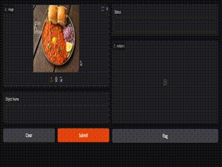

# agentic-object-detection

Still a work in progress..

This is the plan: Use SAM, then clip and then something like gpt4-o on top and add some reasoning..you get this agentic object detection.I mean here is what i did with SAM and clip, i just need to use a good LLM on top and add some reasoning and improve.. Am I missing something? You may star this in case I update it..

If you have an interesting project, let's connect!

https://www.linkedin.com/in/mayankladdha31/
